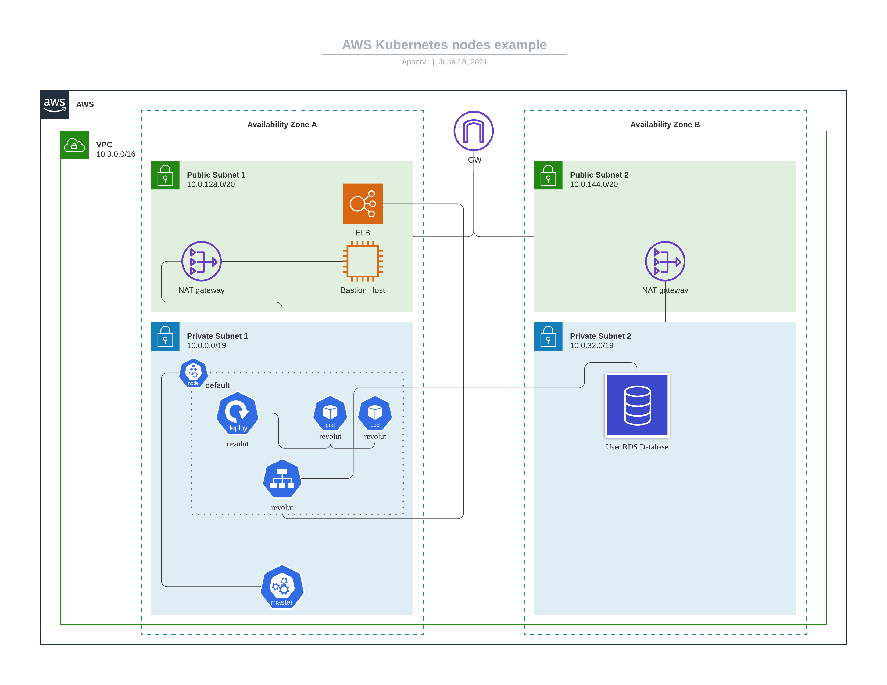

# Task
- Create a web server
- accepts a put request to create entry in database
- if the entry already exists update the birthday if it is different.
- gets the entry from database and displays the difference in days

# Do things

#### Must have

- [x] Python setup
- [x] Docker setup
- [x] Create http listener
- [x] TDD setup
- [x] Basic classes for requests
- [x] DB schema management
- [x] Kubernetes deployment file
- [x] Deployment instructions
- [x] Mount secrets for database connection
- [x] Systems diagram

#### Improvements

- [ ] Readiness and Liveness probe
- [ ] docker-compose setup for local testing
- [ ] create database index for better query response
- [ ] Read and write database routes
- [ ] Use server side caching maybe?

# Instructions

The following instructions assume that the developer has Docker installed.

## Commands

- `make build` : This builds the app image.
- `make org=revolut upload-prod`: This builds the image for production use and uploads it to the specified org url in this case revolut docker hub repository.
- `make port=80 dev`: Starts up the server on listening on host port 80. For development we are using in-memory sqlite database.
- `make test`: run tests

## Directory structure

- `scripts`: This holds the scripts required for distinguishing dependencies installation in dev and prod environment.
- `server`: Holds the application code.
- `tests`: Tests reside here.

## HTTP endpoints

- `/`: 
  - Description: Index, responds with `Hello, world!`
  - Supported Methods: `['Get']`
- `/hello/<username>`:
  - Description: If the http method is `GET` then it returns the day remaining for birthday of user. Otherwise, if the method is `PUT` then it sets/updates the user's birthdate.
  - Supported Methods: `['GET', 'PUT']`

## Deployment

First, we will create the required secret in K8s using the following command. Replace `sqlite://` with correct DB URI.

```bash
kubectl create secrets generic database --from-literal="DB_URI=sqlite://"
```

Upload the artifacts to repository using: 

```bash
make org=revolut upload-prod
```

The above command will first build the image and on success upload it to the organizations repository. 

The above command also outputs a deployment.yml file which can then be used to update Kubernetes cluster using:

```bash
kubectl apply -f deployment.yml
```

### Zero downtime upgrade

For zero downtime upgrade we are using Kubernetes default rolling update deployment strategy. We need to make sure that the development cycle follows backwards compatibility for this strategy to give best results.


## Systems Diagram



- The above is a systems diagram of the setup. We are using EKS for deploying our service in Kubernetes default namespace. 

- The nodes are in private subnet of the vpc and uses the NAT in public subnet to communicate with internet.

- The datebase is a postgres-RDS in a separate private subnet.
- We are exposing the service using Service revolut of type LoadBalancer which creates a ELB in a public subnet in the same availability zone.
